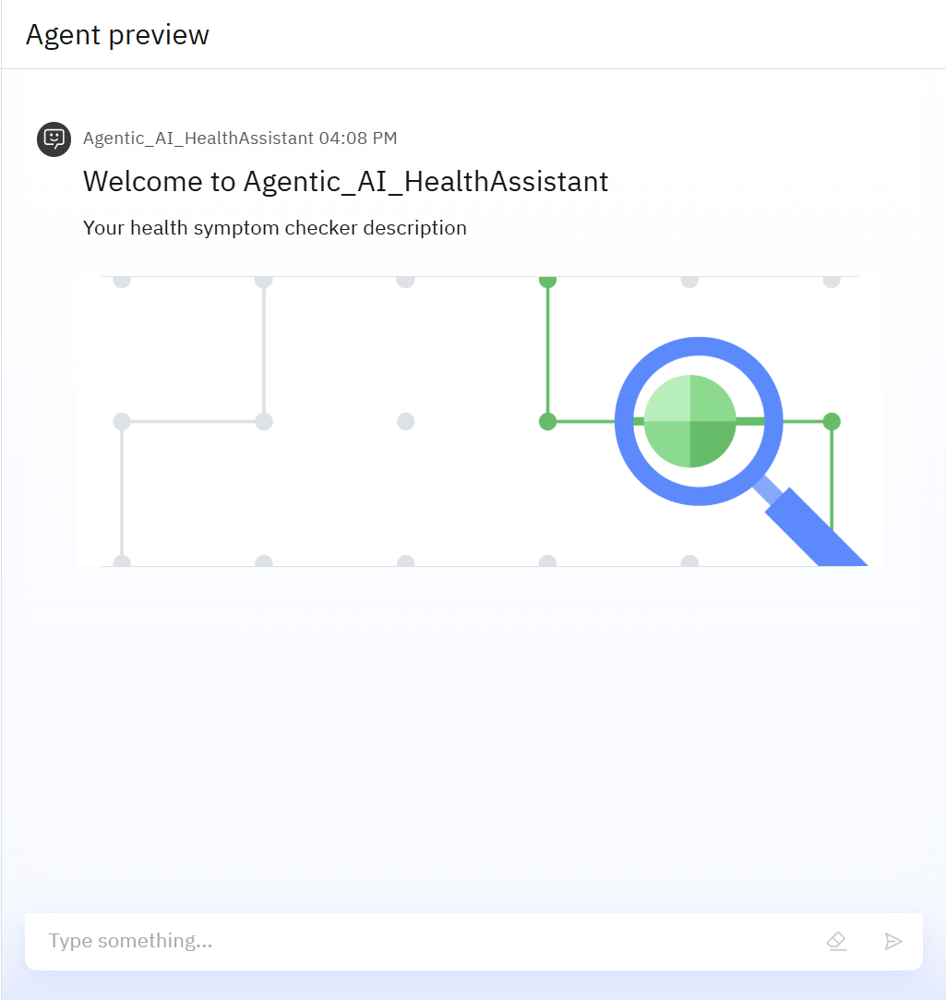

# Agentic AI Health Symptom Checker

Welcome to the Agentic AI Health Symptom Checker project!  
This AI-powered assistant helps users understand their health symptoms, offers probable causes, home care advice, urgency levels, and always encourages consulting healthcare professionals.

---

## 🚀 Project Overview

This project utilizes **IBM Cloud watsonx.ai**, **Granite Foundation Models**, and **Retrieval Augmented Generation (RAG)** to provide safe, evidence-based health guidance.

### ✨ Key Features
- Accepts symptoms in **natural language**
- Answers are **grounded in WHO/CDC/NHS data** (vector index)
- **Disclaimers** ensure user safety; the assistant never diagnoses
- Always prompts users to consult a real healthcare provider if needed

---

## 🖼️ Agent Preview

Below is the preview screenshot of the agent interface:

---

## 📊 Output Screenshots

Here are two example outputs from the agent, displayed side by side for easy comparison:

|  |  |
|:-----------------------------:|:------------------------------:|

---

## 🌐 Deployed Agent – Live Demo Outputs

Screenshots captured from the **deployed AI Health Symptom Checker** showing live user interactions:

|  |  |
|:-----------------------------------:|:-----------------------------------:|

|                                |

---

*For best results, replace all image filenames (`images/...png`) with your actual screenshot filenames in the `images` folder of your repo!*

