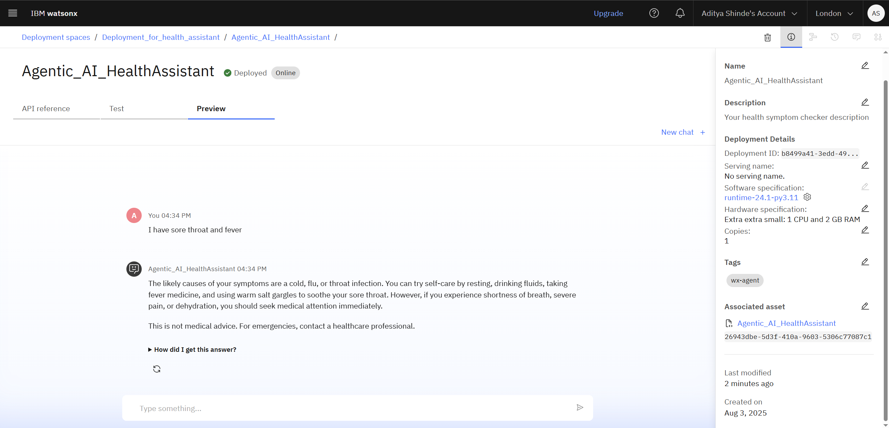

# Agentic AI Health Symptom Checker

Welcome to the Agentic AI Health Symptom Checker project!  
This AI-powered assistant helps users understand their health symptoms, offers probable causes, home care advice, urgency levels, and always encourages consulting healthcare professionals.

---

## 🚀 Project Overview

This project utilizes **IBM Cloud watsonx.ai**, **Granite Foundation Models**, and **Retrieval Augmented Generation (RAG)** to provide safe, evidence-based health guidance.

### ✨ Key Features
- Accepts symptoms in **natural language**
- Answers are **grounded in WHO/CDC/NHS data** (vector index)
- **Disclaimers** ensure user safety; the assistant never diagnoses
- Always prompts users to consult a real healthcare provider if needed

---

## 🛠️ Technology Used

- **IBM Cloud watsonx.ai Studio:** Main environment for building and deploying LLM-powered agents.
- **Granite Foundation Model:** IBM’s cutting-edge large language model for natural, context-aware responses.
- **Retrieval Augmented Generation (RAG):** Ensures answers are grounded and cited from trusted healthcare documents (vector index from WHO/CDC/NHS sources).
- **IBM Cloud Object Storage:** Stores all referenced documents and medical guidance files.
- **Safe Conversation Flows:** Structured so the assistant never diagnoses and always provides clear medical disclaimers.

---

## 🖼️ Agent Preview

  

---

## 📊 Output Screenshots

<!-- 
  This table uses 100% width and has two columns of equal width.
  You can change the `width` attribute of each  tag to adjust the image size.
-->
<table>
  <tr>
    <td>
      
    </td>
    <td>
      
    </td>
  </tr>
</table>

---

## 🌐 Deployed Agent – Live Demo Outputs

  

 

  

 

  

